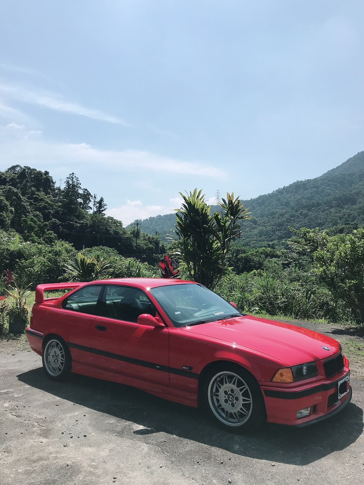

# 🚗 Cult of Drive

> **90s–2000s BMW Culture. Authentic. OEM. Driver’s Cars Only.**  
> A digital homage to the golden era of BMW — built with Next.js 15, Tailwind CSS, and Framer Motion.

---



## ✨ Overview

**Cult of Drive** is a clean, minimal, and atmospheric landing page celebrating the pure driving spirit of 90s and early 2000s BMWs.  
Built for enthusiasts, by enthusiasts — merging aesthetics, performance, and soul.

---

## 🧱 Tech Stack

| Technology | Description |
|-------------|--------------|
| **Next.js 15 (App Router)** | Modern React framework optimized for performance and DX |
| **Tailwind CSS** | Utility-first CSS for responsive, clean UI |
| **Framer Motion** | Smooth, fluid animations and transitions |
| **Biome** | Fast linting, formatting, and code quality checks |
| **TypeScript** | Static typing for reliability and scalability |
| **Vercel** | Zero-config cloud deployment |

---

## ⚙️ Getting Started

### 1. Clone the repository

```bash
git clone https://github.com/kursatdemirdelen/cultofdrive.git
cd cultofdrive
```

### 2. Install dependencies

```bash
npm install
```

### 3. Run the development server

```bash
npm run dev
```

Now open [http://localhost:3000](http://localhost:3000) to see it live 🚀

---

## 🧹 Lint & Formatting

This project uses **Biome** instead of ESLint and Prettier.

```bash
npm run lint
```

If you prefer ESLint, install it manually:

```bash
npm install eslint @typescript-eslint/parser @typescript-eslint/eslint-plugin --save-dev
```

---

## 🧠 Project Structure

```
cultofdrive/
├── app/
│   ├── layout.tsx       # Root layout + metadata
│   ├── page.tsx         # Landing page
│   ├── globals.css      # Global styles
│
├── public/
│   ├── bmw-e36.jpg      # Hero image
│
├── tailwind.config.ts
├── postcss.config.mjs
├── biome.json
├── package.json
└── README.md
```

---

## 🖋️ Metadata

```ts
export const metadata = {
  title: 'Cult of Drive — 90s–2000s BMW Culture',
  description:
    "Authentic. OEM. Driver's Cars Only. Celebrating the golden era of BMW engineering.",
  openGraph: {
    title: 'Cult of Drive',
    description: 'A tribute to the golden era of BMW driving culture.',
    images: ['/bmw-e36.jpg'],
  },
};
```

---

## 💌 Waitlist Integration (optional)

You can easily integrate a mailing list with:
- **Supabase** (database & auth)
- **Resend** (email delivery API)
- **Formspree** (simple form endpoint)

Add your API endpoint in the `handleEmailSubmit()` function inside `page.tsx`.

---

## 🚀 Deployment

Deploy instantly with **[Vercel](https://vercel.com)**:

```bash
vercel deploy
```

✅ Automatic builds  
✅ Edge optimization  
✅ Environment variable support

---

## 🧭 Roadmap

- [ ] Add backend integration for email waitlist  
- [ ] Include Instagram / Twitter live feed  
- [ ] Introduce “Driver’s Garage” gallery  
- [ ] Add multilingual support (EN/TR)  

---

## 🏁 License

This project is open source under the [MIT License](LICENSE).

---

### Made with passion 🖤  
**Cult of Drive** — A tribute to those who still *feel* the road.
