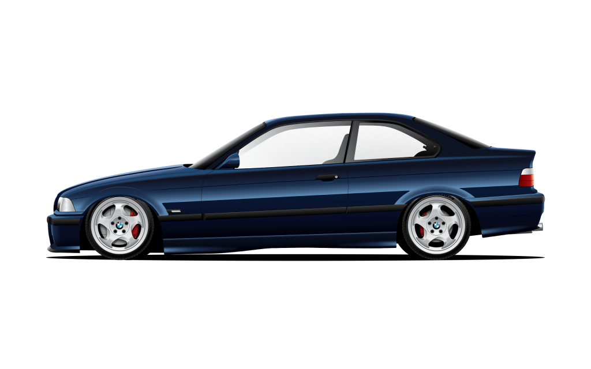

# 🚗 Cult of Drive

> A curated digital garage for 90s–2000s BMW icons. Authentic builds, lived-in stories, and a community that still feels the road.



## ✨ Features

### Core Features
- **Discover**: Browse and search BMW builds with advanced filtering
- **My Garage**: Personal collection management for authenticated users
- **Car Details**: Comprehensive car pages with specs, images, and stories
- **User Profiles**: Driver pages showcasing their builds
- **Admin Dashboard**: Complete car management with moderation tools

### Social Features
- **Favorites**: Save and track your favorite builds
- **Comments**: Engage with the community
- **Real-time Notifications**: Get notified of new favorites and comments
- **Share**: Share builds on social media

### Advanced Features
- **Analytics**: View tracking and engagement metrics
- **Moderation**: Report system with admin review panel
- **Marketplace**: Buy and sell BMW builds
- **Image Gallery**: Multi-image support with lightbox

## 🛠️ Tech Stack

| Layer | Technology |
|-------|-----------|
| Framework | Next.js 15 (App Router) + React 18 |
| Language | TypeScript 5.2 |
| Styling | Tailwind CSS 3.3 |
| Animation | Framer Motion 10.16 |
| Database | Supabase (PostgreSQL) |
| Auth | Supabase Auth |
| Storage | Supabase Storage |
| Deployment | Vercel |

## 🚀 Getting Started

### Prerequisites
- Node.js 18+ and npm
- Supabase account
- Git

### Installation

1. **Clone the repository**
```bash
git clone https://github.com/yourusername/cultofdrive.git
cd cultofdrive
```

For detailed setup instructions, see [SETUP.md](SETUP.md)

2. **Install dependencies**
```bash
npm install
```

3. **Set up environment variables**
```bash
cp env.example .env.local
```

Edit `.env.local` with your Supabase credentials:
```env
NEXT_PUBLIC_SUPABASE_URL=your_supabase_url
NEXT_PUBLIC_SUPABASE_ANON_KEY=your_anon_key
SUPABASE_URL=your_supabase_url
SUPABASE_KEY=your_service_role_key
SUPABASE_SERVICE_ROLE_KEY=your_service_role_key
NEXT_PUBLIC_SITE_URL=http://localhost:3000
```

4. **Set up the database**

Run the SQL files in your Supabase SQL Editor in this order:
```bash
supabase/schema.sql
supabase/notifications.sql
supabase/analytics.sql
supabase/moderation.sql
supabase/marketplace.sql
```

5. **Start the development server**
```bash
npm run dev
```

Visit [http://localhost:3000](http://localhost:3000)

## 📁 Project Structure

```
cultofdrive/
├── app/                      # Next.js App Router
│   ├── admin/               # Admin dashboard
│   ├── api/                 # API routes
│   ├── cars/[id]/          # Car detail pages
│   ├── components/          # Shared components
│   ├── driver/[owner]/     # User profile pages
│   ├── garage/             # Garage pages
│   ├── marketplace/        # Marketplace pages
│   └── page.tsx            # Homepage
├── public/                  # Static assets
├── supabase/               # Database schemas
├── utils/                  # Utility functions
└── README.md
```

## 🗄️ Database Schema

The project uses 11 main tables:
- `cars` - Car listings with specs and details
- `car_images` - Multiple images per car
- `car_views` - Analytics and view tracking
- `favorites` - User favorites system
- `car_comments` - Comments and discussions
- `notifications` - Real-time notifications
- `reports` - Content moderation
- `marketplace_listings` - Marketplace listings
- `marketplace_inquiries` - Buyer inquiries
- `social_posts` - Social feed posts
- `email_subscriptions` - Email subscriptions

## 🔑 Environment Variables

| Variable | Description | Required |
|----------|-------------|----------|
| `NEXT_PUBLIC_SUPABASE_URL` | Supabase project URL | Yes |
| `NEXT_PUBLIC_SUPABASE_ANON_KEY` | Supabase anonymous key | Yes |
| `SUPABASE_URL` | Server-side Supabase URL | Yes |
| `SUPABASE_KEY` | Server-side Supabase key | Yes |
| `SUPABASE_SERVICE_ROLE_KEY` | Admin operations key | Yes |
| `NEXT_PUBLIC_SITE_URL` | Application URL | Yes |
| `NEXT_PUBLIC_GOOGLE_AUTH_ENABLED` | Enable Google OAuth | No |
| `SEED_SECRET` | Development seed data key | No |

## 📜 Available Scripts

```bash
npm run dev          # Start development server
npm run build        # Create production build
npm run start        # Start production server
npm run lint         # Run ESLint
npm run type-check   # TypeScript type checking
```

## 🎨 Key Features Explained

### Admin Dashboard
- Car CRUD operations
- Featured car management
- Moderation queue
- Analytics overview

### Discover Page
- Advanced search and filtering
- Grid/List view toggle
- Sort by newest, oldest, or model
- Featured-only filter

### Marketplace
- Create listings for your cars
- Browse active listings
- Contact sellers directly
- View tracking

### Notifications
- Real-time updates via Supabase subscriptions
- In-app notification center
- Unread badge counter
- Mark as read functionality

## 🔒 Security

- Row Level Security (RLS) policies on all tables
- Admin key authentication for sensitive operations
- Input validation and sanitization
- Content moderation system

## 🚢 Deployment

### Deploy to Vercel

1. Push your code to GitHub
2. Import project in Vercel
3. Add environment variables
4. Deploy

### Post-Deployment
- Configure OAuth providers in Supabase
- Set up custom domain (optional)
- Enable Vercel Analytics

## 🤝 Contributing

Contributions are welcome! Please read [CONTRIBUTING.md](CONTRIBUTING.md) for details on our code of conduct and the process for submitting pull requests.

## 📝 License

This project is licensed under the MIT License - see the [LICENSE](LICENSE) file for details.

## 🙏 Acknowledgments

- BMW community for inspiration and passion
- [Next.js](https://nextjs.org/) team for the amazing framework
- [Supabase](https://supabase.com/) for the backend infrastructure
- [Vercel](https://vercel.com/) for hosting and deployment

## 📧 Contact

For questions or feedback, please open an issue or reach out to the maintainers.

---

**Built with ❤️ for BMW enthusiasts**
